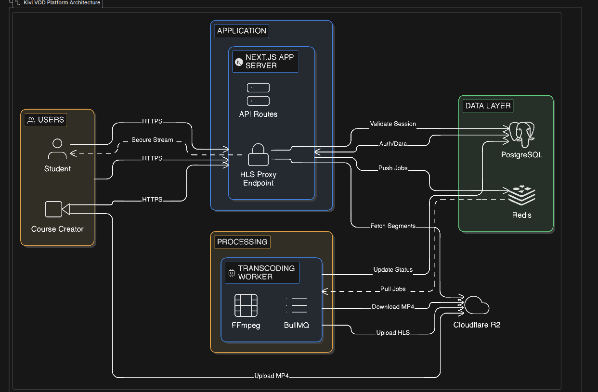

# Kivi - VOD Platform for Course Creators



Kivi is a high-performance Video-on-Demand (VOD) platform designed for course creators, featuring a robust video processing pipeline and secure adaptive bitrate streaming.

## 🚀 Key Features

- **Adaptive HLS Streaming**: Automated transcoding to 720p/480p for smooth playback.
- **Secure Delivery**: Custom HLS proxy validates user sessions for every 6-second video segment.
- **Asynchronous Processing**: Background workers handle heavy FFmpeg tasks via BullMQ.
- **Zero Egress Storage**: Leverages Cloudflare R2 to keep delivery costs low.

## 🛠️ Tech Stack

- **Frontend**: Next.js 15 (App Router), Tailwind CSS, Shadcn UI
- **Backend**: Node.js, Prisma ORM (PostgreSQL)
- **Infra**: Bun, Redis, BullMQ, Cloudflare R2
- **Processing**: FFmpeg

## 🏁 Quick Start

1. **Install Dependencies**:
   ```bash
   bun install
   ```

2. **Environment Setup**:
   Copy `.env.example` to `.env` and configure your Database, Redis, and R2 credentials.

3. **Database Setup**:
   ```bash
   bunx prisma db push
   ```

4. **Run Development Server**:
   ```bash
   bun dev
   ```

5. **Run Transcoding Worker**:
   ```bash
   bun run worker:transcode
   ```

---
*For detailed technical documentation, see the `architecture/` artifacts.*